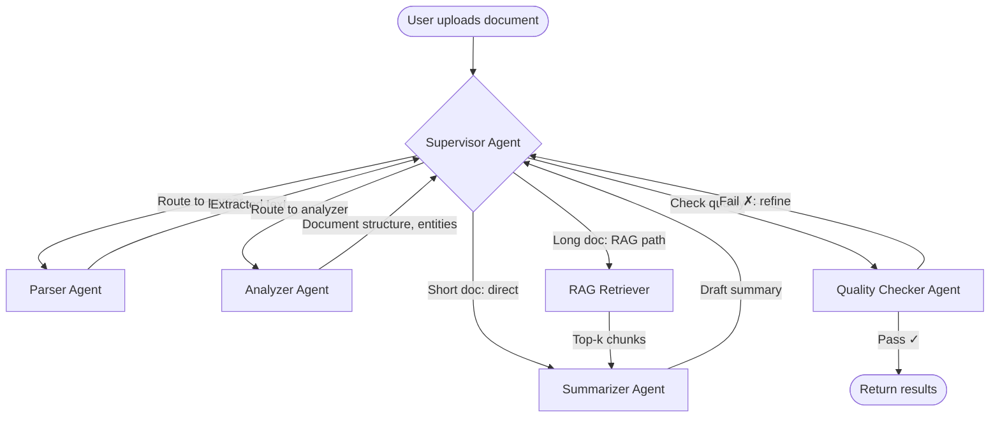
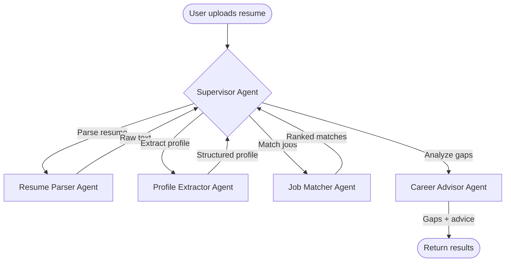

# Saransh — Implementation Plan (v2)

## Overview

**Saransh** is an **agentic AI** document summarizer with a Resume Mode USP, built on **LangGraph multi-agent orchestration** and **Amazon Bedrock**. Users upload documents and a team of specialized AI agents collaboratively processes, analyzes, and summarizes them. In Resume Mode, agents parse resumes, extract profiles, match against jobs, and provide career guidance.

**Key differentiator from a plain RAG pipeline:** Saransh uses a **Supervisor-Worker agent graph** where a supervisor agent routes tasks to specialized worker agents (Parser, Analyzer, Summarizer, Quality Checker), each making independent LLM decisions. This is proper agentic AI — not just "embed → retrieve → generate."

**System:** Windows, Node v20.12, Python 3.12, npm 10.5  
**GitHub:** https://github.com/Chinmayyyy/saransh-summarizer  
**Branding:** "Built by Chinmay"

---

## Model Selection (Cheapest on Bedrock)

| Purpose | Model | Model ID | Price |
|---|---|---|---|
| **LLM (all agents)** | Amazon Nova Micro | `amazon.nova-micro-v1:0` | $0.035/1M input, $0.14/1M output |
| **Embeddings** | Amazon Titan Embed Text v2 | `amazon.titan-embed-text-v2:0` | $0.02/1M tokens |

> [!NOTE]
> Nova Micro is **~30x cheaper** than Claude Haiku and is an Amazon first-party model. It's text-only (no vision), which is perfect for document summarization. For a typical 5000-token document, total cost ≈ $0.0009 per request.

---

## AWS Bedrock Access Setup Guide (for Chinmay)

> [!IMPORTANT]
> Follow these steps before running the backend. You need: an AWS account, an IAM user with programmatic access, and model access enabled.

### Step 1: Create an IAM User with Programmatic Access
1. Go to **AWS Console** → **IAM** → **Users** → **Create user**
2. Name: `saransh-backend` (or any name)
3. Select **"Attach policies directly"**
4. Search and attach: **`AmazonBedrockFullAccess`** (for dev; we'll restrict for prod)
5. Click **Create user**
6. Go to the user → **Security credentials** tab → **Create access key**
7. Select **"Application running outside AWS"** → Create
8. **Save the Access Key ID and Secret Access Key** — you won't see the secret again

### Step 2: Enable Model Access in Bedrock Console
1. Go to **AWS Console** → **Amazon Bedrock** → **Model access** (left sidebar)
2. Click **"Modify model access"**
3. Enable checkboxes for:
   - ✅ Amazon Nova Micro
   - ✅ Amazon Titan Text Embeddings V2
4. Click **"Save changes"** — wait for status to show "Access granted"

### Step 3: Configure Credentials Locally
```powershell
# Option A: AWS CLI (recommended)
aws configure
# Enter: Access Key ID, Secret Access Key, Region: us-east-1, Output: json

# Option B: Environment variables (in your .env file)
AWS_ACCESS_KEY_ID=your-key-here
AWS_SECRET_ACCESS_KEY=your-secret-here
AWS_DEFAULT_REGION=us-east-1
```

### Step 4: Test Access
```powershell
pip install boto3
python -c "import boto3; c=boto3.client('bedrock-runtime',region_name='us-east-1'); print('Connected!')"
```

---

## Multi-Agent Architecture (LangGraph)

This is the core agentic design. Each mode has its own **StateGraph** with specialized agents.

### Summarize Mode — Agent Graph



#### Agent Descriptions

| Agent | Role | LLM Calls | Tools |
|---|---|---|---|
| **Supervisor** | Routes tasks, decides workflow, handles retries | Yes (Nova Micro) | Routing logic, state management |
| **Parser Agent** | Extracts text from uploaded file | No (deterministic) | PyMuPDF, python-docx, pandas |
| **Analyzer Agent** | Identifies document type, structure, key entities, metadata | Yes (Nova Micro) | Entity extraction prompt |
| **RAG Retriever** | Chunks text, embeds, retrieves top-k relevant chunks | No (embedding model) | FAISS, Titan Embeddings |
| **Summarizer Agent** | Generates short summary, detailed summary, key points, keywords | Yes (Nova Micro) | Summarization prompts |
| **Quality Checker** | Validates summary covers key points, checks for hallucinations | Yes (Nova Micro) | Validation prompt, comparison logic |

#### Agent State Schema
```python
class SummarizeState(TypedDict):
    # Input
    file_bytes: bytes
    filename: str
    # Parser output
    raw_text: str
    file_type: str
    # Analyzer output
    doc_type: str          # "report", "article", "data", "letter", etc.
    entities: list[str]
    metadata: dict
    # RAG
    chunks: list[str]
    relevant_chunks: list[str]
    # Summarizer output
    short_summary: str
    detailed_summary: str
    key_points: list[str]
    keywords: list[str]
    # Quality
    quality_pass: bool
    quality_feedback: str
    retry_count: int
    # Control
    next_agent: str
    error: str | None
```

#### Decision Logic
- **Short docs** (< 2000 tokens): Supervisor skips RAG, sends directly to Summarizer
- **Long docs** (≥ 2000 tokens): Supervisor routes through RAG Retriever first
- **Quality Check fails** (max 1 retry): Supervisor sends quality feedback + original to Summarizer for refinement
- **Parser errors**: Supervisor returns error immediately with helpful message

---

### Resume Mode — Agent Graph



#### Agent Descriptions

| Agent | Role | LLM Calls |
|---|---|---|
| **Supervisor** | Orchestrates resume analysis pipeline | Yes |
| **Resume Parser** | Extracts text from resume file | No (deterministic) |
| **Profile Extractor** | Uses LLM to extract name, skills, tools, experience, education, projects, domains | Yes (Nova Micro) |
| **Job Matcher** | Embeds resume profile + job descriptions, computes similarity, ranks top-N | Embeddings only |
| **Career Advisor** | For each top match: explains why it fits, identifies missing skills, suggests improvements | Yes (Nova Micro) |

#### Agent State Schema
```python
class ResumeState(TypedDict):
    # Input
    file_bytes: bytes
    filename: str
    # Parser
    raw_text: str
    # Profile Extractor
    profile: ResumeProfile  # name, skills, tools, experience, education, domains
    # Matcher
    job_postings: list[dict]
    match_scores: list[dict]  # job + score pairs
    top_matches: list[dict]
    # Advisor
    match_explanations: list[JobMatch]  # with why, gaps, suggestions
    # Control
    next_agent: str
    error: str | None
```

---

## Project Structure

```
c:\Users\chinm\Desktop\Bedrock Content Summarizer\
├── backend/
│   ├── app/
│   │   ├── __init__.py
│   │   ├── main.py                  # FastAPI app, CORS, lifespan, health check
│   │   ├── config.py                # Pydantic settings from .env
│   │   ├── routers/
│   │   │   ├── __init__.py
│   │   │   ├── summarize.py         # POST /api/summarize
│   │   │   └── resume.py            # POST /api/resume-match
│   │   ├── agents/                  # ← LangGraph multi-agent graphs
│   │   │   ├── __init__.py
│   │   │   ├── state.py             # State schemas (TypedDict)
│   │   │   ├── summarize_graph.py   # Summarize mode agent graph
│   │   │   ├── resume_graph.py      # Resume mode agent graph
│   │   │   └── nodes/               # Individual agent node functions
│   │   │       ├── __init__.py
│   │   │       ├── parser.py        # Parser agent (deterministic)
│   │   │       ├── analyzer.py      # Document analyzer agent (LLM)
│   │   │       ├── rag_retriever.py # RAG retriever (embeddings + FAISS)
│   │   │       ├── summarizer.py    # Summarizer agent (LLM)
│   │   │       ├── quality_checker.py # Quality checker agent (LLM)
│   │   │       ├── profile_extractor.py # Resume profile extractor (LLM)
│   │   │       ├── job_matcher.py   # Job matching (embeddings + similarity)
│   │   │       └── career_advisor.py  # Career advice agent (LLM)
│   │   ├── services/
│   │   │   ├── __init__.py
│   │   │   ├── llm_service.py       # Bedrock Nova Micro + local fallback
│   │   │   ├── embedding_service.py  # Bedrock Titan Embed + local fallback
│   │   │   └── vector_store.py       # FAISS wrapper
│   │   ├── middleware/
│   │   │   ├── __init__.py
│   │   │   └── rate_limiter.py       # slowapi rate limiting
│   │   ├── models/
│   │   │   ├── __init__.py
│   │   │   └── schemas.py            # Pydantic request/response models
│   │   └── data/
│   │       └── jobs.json             # Sample job postings (25-30 roles)
│   ├── tests/
│   │   ├── __init__.py
│   │   ├── test_parser.py
│   │   ├── test_agents.py
│   │   └── test_api.py
│   ├── requirements.txt
│   ├── Dockerfile
│   └── .env.example
│
├── frontend/
│   ├── public/
│   │   └── favicon.svg
│   ├── src/
│   │   ├── main.jsx
│   │   ├── App.jsx
│   │   ├── index.css
│   │   ├── components/
│   │   │   ├── Layout.jsx
│   │   │   ├── Header.jsx
│   │   │   ├── Footer.jsx
│   │   │   ├── ModeSwitch.jsx
│   │   │   ├── FileUpload.jsx
│   │   │   ├── SampleDocs.jsx
│   │   │   ├── LoadingState.jsx
│   │   │   ├── ErrorState.jsx
│   │   │   ├── SummaryResult.jsx
│   │   │   └── ResumeResult.jsx
│   │   ├── hooks/
│   │   │   └── useUpload.js
│   │   └── utils/
│   │       └── api.js
│   ├── index.html
│   ├── package.json
│   ├── vite.config.js
│   ├── tailwind.config.js
│   └── postcss.config.js
│
├── .github/workflows/ci.yml
├── .gitignore
├── .env.example
├── README.md
└── LICENSE
```

---

## Proposed Changes

### Backend — Agents Layer (NEW — the agentic core)

#### [NEW] [state.py](file:///c:/Users/chinm/Desktop/Bedrock%20Content%20Summarizer/backend/app/agents/state.py)
- `SummarizeState(TypedDict)` — shared state for summarize agent graph
- `ResumeState(TypedDict)` — shared state for resume agent graph
- Both include control fields (`next_agent`, `error`, `retry_count`)

#### [NEW] [summarize_graph.py](file:///c:/Users/chinm/Desktop/Bedrock%20Content%20Summarizer/backend/app/agents/summarize_graph.py)
LangGraph `StateGraph` for summarization:
```python
from langgraph.graph import StateGraph, END

graph = StateGraph(SummarizeState)
graph.add_node("parser", parser_node)
graph.add_node("analyzer", analyzer_node)
graph.add_node("rag_retriever", rag_retriever_node)
graph.add_node("summarizer", summarizer_node)
graph.add_node("quality_checker", quality_checker_node)

graph.set_entry_point("parser")
graph.add_edge("parser", "analyzer")
graph.add_conditional_edges("analyzer", supervisor_route_after_analysis,
    {"direct_summarize": "summarizer", "rag_summarize": "rag_retriever"})
graph.add_edge("rag_retriever", "summarizer")
graph.add_conditional_edges("summarizer", lambda s: "quality_checker",
    {"quality_checker": "quality_checker"})
graph.add_conditional_edges("quality_checker", check_quality,
    {"pass": END, "retry": "summarizer"})

summarize_app = graph.compile()
```

Key supervisor decisions encoded as conditional edges:
- After analysis: choose direct summarization vs RAG based on document length
- After quality check: pass (return) or retry (max 1 retry with feedback)

#### [NEW] [resume_graph.py](file:///c:/Users/chinm/Desktop/Bedrock%20Content%20Summarizer/backend/app/agents/resume_graph.py)
LangGraph `StateGraph` for resume matching:
```python
graph = StateGraph(ResumeState)
graph.add_node("parser", resume_parser_node)
graph.add_node("profile_extractor", profile_extractor_node)
graph.add_node("job_matcher", job_matcher_node)
graph.add_node("career_advisor", career_advisor_node)

graph.set_entry_point("parser")
graph.add_edge("parser", "profile_extractor")
graph.add_edge("profile_extractor", "job_matcher")
graph.add_edge("job_matcher", "career_advisor")
graph.add_edge("career_advisor", END)

resume_app = graph.compile()
```

#### [NEW] Agent Nodes (`backend/app/agents/nodes/`)

Each node is a function `(state: State) -> dict` that returns state updates:

| File | Agent | What it does |
|---|---|---|
| `parser.py` | Parser | Uses PyMuPDF/python-docx/pandas to extract text. Returns `raw_text`, `file_type` |
| `analyzer.py` | Analyzer | Calls Nova Micro to identify doc type, extract entities/metadata. Returns `doc_type`, `entities`, `metadata` |
| `rag_retriever.py` | RAG Retriever | Chunks text, embeds with Titan, stores in FAISS, retrieves top-k. Returns `chunks`, `relevant_chunks` |
| `summarizer.py` | Summarizer | Calls Nova Micro with context to generate summaries. Returns `short_summary`, `detailed_summary`, `key_points`, `keywords` |
| `quality_checker.py` | Quality Checker | Calls Nova Micro to validate summary quality. Returns `quality_pass`, `quality_feedback` |
| `profile_extractor.py` | Profile Extractor | Calls Nova Micro to parse resume into structured profile. Returns `profile` |
| `job_matcher.py` | Job Matcher | Embeds profile + jobs, computes cosine similarity, ranks. Returns `top_matches` |
| `career_advisor.py` | Career Advisor | Calls Nova Micro to explain each match, identify gaps. Returns `match_explanations` |

---

### Backend — Services Layer

#### [NEW] [llm_service.py](file:///c:/Users/chinm/Desktop/Bedrock%20Content%20Summarizer/backend/app/services/llm_service.py)

Abstraction over LLM calls:
- **`BedrockLLMService`**: Uses `boto3` `bedrock-runtime` client with `invoke_model` for `amazon.nova-micro-v1:0`
- **`LocalFallbackLLM`**: TF-IDF extractive summarization (no GPU, instant)
- Factory: auto-detects Bedrock availability on startup
- All methods: `generate(prompt, system_prompt, max_tokens, temperature) -> str`
- Also integrates with `langchain-aws` `ChatBedrock` for agent nodes

#### [NEW] [embedding_service.py](file:///c:/Users/chinm/Desktop/Bedrock%20Content%20Summarizer/backend/app/services/embedding_service.py)

- **`BedrockEmbeddingService`**: `amazon.titan-embed-text-v2:0` via boto3
- **`LocalEmbeddingService`**: `sentence-transformers/all-MiniLM-L6-v2`
- Method: `embed(texts: list[str]) -> list[list[float]]`

#### [NEW] [vector_store.py](file:///c:/Users/chinm/Desktop/Bedrock%20Content%20Summarizer/backend/app/services/vector_store.py)

- FAISS in-memory index (created fresh per request — no persistence needed)
- `index_chunks(chunks, embeddings)` → FAISS index
- `search(query_embedding, top_k=5)` → list of chunk texts

---

### Backend — API + Config + Security

#### [NEW] [main.py](file:///c:/Users/chinm/Desktop/Bedrock%20Content%20Summarizer/backend/app/main.py)
- FastAPI with CORS, rate limiting, file size limits
- `POST /api/summarize` — accepts multipart file upload, runs summarize agent graph
- `POST /api/resume-match` — accepts multipart file upload, runs resume agent graph
- `GET /api/health` — health check

#### [NEW] [config.py](file:///c:/Users/chinm/Desktop/Bedrock%20Content%20Summarizer/backend/app/config.py)
- `AWS_REGION` = `us-east-1`
- `BEDROCK_LLM_MODEL_ID` = `amazon.nova-micro-v1:0`
- `BEDROCK_EMBEDDING_MODEL_ID` = `amazon.titan-embed-text-v2:0`
- `USE_BEDROCK` = `true` (falls back gracefully if credentials missing)
- `MAX_FILE_SIZE_MB` = `10`
- `RATE_LIMIT_PER_MINUTE` = `20`

#### [NEW] [rate_limiter.py](file:///c:/Users/chinm/Desktop/Bedrock%20Content%20Summarizer/backend/app/middleware/rate_limiter.py)
- `slowapi`: 20 req/min per IP, 5 uploads/min per IP
- Returns 429 with helpful message

#### [NEW] [schemas.py](file:///c:/Users/chinm/Desktop/Bedrock%20Content%20Summarizer/backend/app/models/schemas.py)
- `SummaryResponse`, `ResumeMatchResponse`, `JobMatch`, `ResumeProfile` (same as v1 plan)

#### [NEW] [jobs.json](file:///c:/Users/chinm/Desktop/Bedrock%20Content%20Summarizer/backend/app/data/jobs.json)
- 25-30 curated job postings across tech, data, ML, frontend, backend, DevOps, PM roles

---

### Frontend — React + Vite + Tailwind v3

Same as v1 plan. Key components:
- **Header**: "Saransh" wordmark + "AI-Powered Document Intelligence"
- **Footer**: "Built by Chinmay" + GitHub link (https://github.com/Chinmayyyy/saransh-summarizer)
- **ModeSwitch**: Summarize ↔ Resume Mode pill toggle
- **FileUpload**: Drag-and-drop with validation
- **SummaryResult**: Short/detailed summary, key points, keywords, metadata
- **ResumeResult**: Profile card, ranked job matches with scores/gaps/advice
- **LoadingState**: Step-by-step agent progress ("Parsing..." → "Analyzing..." → "Summarizing..." → "Checking quality...")
- **ErrorState**: Contextual error messages

Design: white + black, Inter font, JetBrains Mono for technical text, editorial/typewriter aesthetic, subtle gray borders, elegant spacing.

---

### Deployment

#### Frontend → Vercel (free)
- `vercel.json` with `VITE_API_URL` env pointing to backend
- Auto-deploy from GitHub main branch

#### Backend → AWS Elastic Beanstalk (free tier)
- Docker-based deployment on t2.micro (750 hrs/mo free)
- Environment variables set in EB console
- Same region as Bedrock (us-east-1)
- HTTPS via AWS Certificate Manager + EB load balancer

Alternative: AWS Lightsail ($3.50/mo) if EB is too complex.

---

## Build Order (Milestones)

### Phase 1: Project Scaffolding
- [ ] Create full directory structure
- [ ] Initialize frontend (Vite + React + Tailwind v3)
- [ ] Initialize backend (FastAPI skeleton + requirements.txt)
- [ ] Create `.env.example`, `.gitignore`

### Phase 2: Backend — Document Parsing + Services
- [ ] `config.py` — settings
- [ ] `llm_service.py` — Bedrock Nova Micro + local fallback
- [ ] `embedding_service.py` — Bedrock Titan + local fallback
- [ ] `vector_store.py` — FAISS wrapper
- [ ] `schemas.py` — Pydantic models

### Phase 3: Backend — Agentic Graphs (Core)
- [ ] `state.py` — agent state schemas
- [ ] Agent nodes: `parser.py`, `analyzer.py`, `rag_retriever.py`, `summarizer.py`, `quality_checker.py`
- [ ] `summarize_graph.py` — compile LangGraph for Summarize mode
- [ ] Agent nodes: `profile_extractor.py`, `job_matcher.py`, `career_advisor.py`
- [ ] `resume_graph.py` — compile LangGraph for Resume mode
- [ ] `jobs.json` — sample job postings

### Phase 4: Backend — API Layer
- [ ] `main.py` — FastAPI app with CORS, rate limiting
- [ ] `rate_limiter.py` — slowapi middleware
- [ ] `summarize.py` router — wire to summarize_graph
- [ ] `resume.py` router — wire to resume_graph
- [ ] Health check endpoint
- [ ] Error handling

### Phase 5: Frontend
- [ ] Design system (index.css, tailwind.config.js, Google Fonts)
- [ ] Layout, Header ("Saransh"), Footer ("Built by Chinmay")
- [ ] ModeSwitch toggle
- [ ] FileUpload (drag-and-drop, validation)
- [ ] API integration (useUpload hook)
- [ ] SummaryResult panel
- [ ] ResumeResult panel
- [ ] Loading states (agent step progress)
- [ ] Error states
- [ ] Responsive design

### Phase 6: Security + Docs
- [ ] File validation hardening
- [ ] Rate limiting tuning
- [ ] Dockerfile
- [ ] README.md with architecture, setup, deployment guide
- [ ] `.github/workflows/ci.yml`

### Phase 7: Verification
- [ ] Test all 6 file formats parse correctly
- [ ] Test summarize agent graph end-to-end
- [ ] Test resume agent graph end-to-end
- [ ] Test local fallback mode (no AWS)
- [ ] Test rate limiting
- [ ] Test file size/type rejection
- [ ] Visual review of frontend
- [ ] Browser recording of full user flow

---

## Verification Plan

### Automated Tests
```powershell
cd backend
python -m pytest tests/ -v
```
- Parser tests: each file type
- Agent graph tests: mock LLM, verify state transitions
- API tests: endpoint responses, error codes

### Manual Verification
- Upload PDF → verify multi-agent pipeline produces quality summary
- Upload resume → verify job matches with scores and explanations
- Verify agent step progress shows in frontend loading state
- Test with no AWS credentials → verify local fallback works
- Rapid-fire requests → verify rate limiting returns 429
- Upload 15MB file → verify rejection
- Upload .exe file → verify rejection
